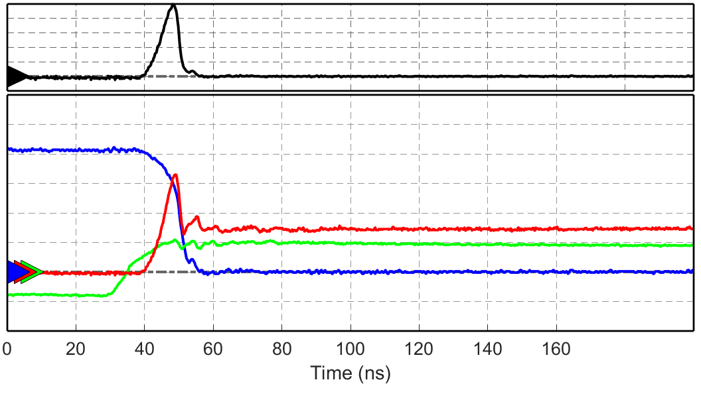

# DoublePulseResults
## Table of Contents
[TOC]

## Super Classes
matlab.mixin.Copyable

## Properties
### turnOnWaveform
| Properties | |
|---------|:--|
| Type | SwitchWaveform |
| Units |  |
| Description | The [SwitchWaveform][SwitchWaveform] containing the data for the turn on. |
|||

### turnOffWaveform
| Properties | |
|---------|:--|
| Type | SwitchWaveform |
| Units |  |
| Description | The [SwitchWaveform][SwitchWaveform] containing the data for the turn off. |
|||

### fullWaveform
| Properties | |
|---------|:--|
| Type | FullWaveform |
| Units |  |
| Description | The [FullWaveform][FullWaveform] containing the data for the entire pulse. |
|||

### numChannels
| Properties | |
|---------|:--|
| Type | Integer |
| Units |  |
| Description | The number of channels captured in the DoublePulseResults object. |
|||

## Shared Properties
### busVoltage
| Properties | |
|---------|:--|
| Type | Float |
| Units | Volts |
| Description | The bus voltage during the pulse. This value is calculated by the [calcBusVoltage](#calcbusvoltage) method.|
|||

### loadCurrent
| Properties | |
|---------|:--|
| Type | Float |
| Units | Amps |
| Description | The load current during the pulse. This value is calculated by the [calcLoadCurrent](#calcloadcurrent) method. |
|||

### gateVoltage
| Properties | |
|---------|:--|
| Type | Float |
| Units | Volts |
| Description | The gate voltage during the pulse. This value is calculated by the [calcGateVoltage](#calcgatevoltage) Method. |
|||

### ivMisalignment
| Properties | |
|---------|:--|
| Type | Float |
| Units | Seconds |
| Description | The misalignment between the current and the voltage waveforms. This value is calculated by the [calcIVMisalignment](#calcivmisalignment) method. |
|||

## Turn On Properties
### turnOnEnergy
| Properties | |
|---------|:--|
| Type | Float |
| Units | Joules |
| Description | The turn on energy loss of the device. Calculated with the [calcTurnOnEnergy](#calcturnonenergy) Method. |
|||

### turnOnDelay        
| Properties | |
|---------|:--|
| Type | Float |
| Units | Seconds |
| Description | The time between the gate rise and the current rise. Calculated with the [calcTurnOnDelay](#calcturnondelay) method. |
|||

### voltageFallTime
| Properties | |
|---------|:--|
| Type | Float |
| Units | Seconds |
| Description | The time from the start of the voltage falling to the point where the voltage crosses zero. Calculated with the [calcVoltageFallTime](#calcvoltagefalltime) method. |
|||

### currentRiseTime
| Properties | |
|---------|:--|
| Type | Float |
| Units | Seconds |
| Description | The time from the start of the current rise to the point where the current is at the load current. Calculated with the [calcCurrentRiseTime](#calccurrentrisetime) method. |
|||

### turnOnTime
| Properties | |
|---------|:--|
| Type | Float |
| Units | Seconds |
| Description | The time from the start of the gate rise to the time where the bus voltage drops to zero. This value is calculated with the [calcTurnOnTime](#calcturnontime) method. |
|||

### turnOnPeakDV_DT
| Properties | |
|---------|:--|
| Type | Float |
| Units | $\frac{Volts}{Second}$ |
| Description | The maximum rate of change in voltage during the turn on. Calculated with the [calcTurnOnPeakDV_DT](#calcturnonpeakdvdt) method.  |
|||

### pOn
| Properties | |
|---------|:--|
| Type | [Float] |
| Units | Watts |
| Description | Power waveform during turn on. |
|||

### turnOnPeakVDS
| Properties | |
|---------|:--|
| Type | Float |
| Units | Volts |
| Description | Maximum value of $V_{DS}$ during the turn on. Calculated with the [calcPeakVDS](#calcpeakvds) method. |
|||

### turnOnVDSInt
| Properties | |
|---------|:--|
| Type | Float |
| Units | Volt $\cdot$ Seconds |
| Description | The integral of $V_{DS}$ from the start of the turn on to the end of the turn on. Calculated during the [calcOnIntegrals](#calconintegrals) method. |
|||

### turnOnIDInt
| Properties | |
|---------|:--|
| Type | Float |
| Units | Amp $\cdot$ Seconds |
| Description | The integral of $I_{D}$ from the start of the turn on to the end of the turn on. Calculated during the [calcOnIntegrals](#calconintegrals) method. |
|||

## Turn Off Properties
### turnOffEnergy
| Properties | |
|---------|:--|
| Type | Float |
| Units | Joules |
| Description | The turn off energy loss of the pulse. Calculated with the [calcTurnOffEnergy](#calcturnoffenergy) method. |
|||

### turnOffDelay
| Properties | |
|---------|:--|
| Type | Float |
| Units | Seconds |
| Description | The time from the start of the gate fall to the start of the current fall. Calculated with the [calcTurnOffDelay](#calcturnoffdelay) method. |
|||

### voltageRiseTime
| Properties | |
|---------|:--|
| Type | Float |
| Units | Seconds |
| Description | The time from the start of the $V_{DS}$ voltage rise to the point where the voltage is at the bus voltage. Calculated with the [calcVoltageRiseTime](#calcvoltagerisetime) method. |
|||

### turnOffTime
| Properties | |
|---------|:--|
| Type | Float |
| Units | Seconds |
| Description | The time from the start of the $V_{GS}$ voltage fall to the point where $V_{DS}$ is at the bus voltage. Calculated with the [calcTurnOffTime](#calcturnofftime) method. |
|||

### turnOffPeakDV_DT
| Properties | |
|---------|:--|
| Type | Float |
| Units | $\frac{Volts}{Second}$ |
| Description | The maximum rate of change of $V_{DS}$ during the turn off. Calculated with the [calcTurnOffPeakDV_DT](#calcturnoffpeakdvdt) method. |
|||

### pOff
| Properties | |
|---------|:--|
| Type | [Float] |
| Units | Watts |
| Description | The power waveform during the turn off pulse. Calculated during the [calcTurnOffEnergy](#calcturnoffenergy) method. |
|||

### turnOffPeakVDS
| Properties | |
|---------|:--|
| Type | Float |
| Units | Volts |
| Description | The maximum value of $V_{DS}$ during the turn off. Calculated with the [calcPeakVDS](#calcpeakvds) method. |
|||

### turnOffVDSInt
| Properties | |
|---------|:--|
| Type | Float |
| Units | Volt $\cdot$ Seconds |
| Description | The integral of $V_{DS}$ from the start of the turn off to the end of the turn off. Calculated during the [calcOffIntegrals](#calcoffintegrals) method. |
|||

### turnOffIDInt
| Properties | |
|---------|:--|
| Type | Float |
| Units | Amp $\cdot$ Seconds |
| Description | The integral of $I_{D}$ from the start of the turn off to the end of the turn off. Calculated during the [calcOffIntegrals](#calcoffintegrals) method. |
|||

## Properties (Private)
### gateTurnOnIdx
| Properties | |
|---------|:--|
| Default Value |  |
| Type | Integer |
| Units |  |
| Description | Index in turn on waveforms where $V_{GS}$ starts to increase and does not stop increasing. Calculated with the [calcGateTurnOffIdx](#calcgateturnoffidx) method. |
|||

### currentTurnOnIdx
| Properties | |
|---------|:--|
| Default Value |  |
| Type | Integer |
| Units |  |
| Description | Index in the turn on waveform where the current starts to rise and does not stop rising. Calculated with the [calcCurrentTurnOnIdx](#calccurrentturnonidx) method. |
|||

### v_ds_at0Idx
| Properties | |
|---------|:--|
| Default Value |  |
| Type | Integer |
| Units |  |
| Description | Index in the turn on waveform where $V_{DS}$ crosses zero. Calculated during the calcVoltageFallTime method. |
|||

### gateTurnOffIdx
| Properties | |
|---------|:--|
| Default Value |  |
| Type | Integer |
| Units |  |
| Description | Index in the turn off waveform where $V_{GS}$ starts to decrease and does not stop. Calculated with the [calcGateTurnOffIdx](#calcgateturnoffidx) method. |
|||

### currentTurnOffIdx
| Properties | |
|---------|:--|
| Default Value |  |
| Type | Integer |
| Units |  |
| Description | Index in the turn off waveform where the current starts to decrease and does not stop. Calculated with the [calcCurrentTurnOffIdx](#calccurrentturnoffidx) method. |
|||

### vDSatBus
| Properties | |
|---------|:--|
| Default Value |  |
| Type | Integer |
| Units |  |
| Description | Index in the turn off waveform where $V_{DS}$ crosses the bus voltage. Calculated during the [calcVoltageRiseTime](#calcvoltagerisetime) method. |
|||

## Methods
### Constructor
| Method | |
|--------|:--|
| Arguments | ((SwitchWaveform) onWaveforms, (SwitchWaveform) offWaveforms) |
| Output | DoublePulseResults |
| Description | Creates a new DoublePulseResults object, sets the on and off SwitchWaveform, determines the number of channels, and calculates all values. If no arguments are given, no errors will be thrown; however, the waveforms and number of channels will need to be set and all values will need to be calculated before the object can be fully used. |
|||

### shiftCurrent
| Method | |
|--------|:--|
| Arguments | ((float) nanoSec) |
| Output |  |
| Description | Shift Current By nanoSec ns. A positive value will shift to the right and a negative value will shift to the left. |
|||

### calcAllValues
| Method | |
|--------|:--|
| Arguments |  |
| Output |  |
| Description | Calculates all properties by calling their corresponding "calc" method. |
|||

### pubCalcIvMis
| Method | |
|--------|:--|
| Arguments |  |
| Output |  |
| Description | Public method that calls the private [calcIVMisalignment](#calcivmisalignment) method. |
|||

### dispResults
| Method | |
|--------|:--|
| Arguments |  |
| Output |  |
| Description | Output results to the command window. |
|||

### plotResults
| Method | |
|--------|:--|
| Arguments |  |
| Output |  |
| Description | Generates plots for the turn on, turn off, and full waveforms. Example turn on plot shown below.|
|||

### plotWaveform
| Method | |
|--------|:--|
| Arguments | ((SwitchWaveform \| GeneralWaveform) waveform, (String) name, [(Float Array) power]) |
| Output |  |
| Description | Plots a given waveform and gives the figure a title of name. The power argument is optional, but should be included if the waveform is a SwitchWaveform. |
|||

### plotWaveformsScopeStyle
| Method | |
|--------|:--|
| Arguments | (Float) Array timeBoundsOn, (Float) Array timeBoundsOff |
| Output |  |
| Description | Plots the turn on and turn off waveforms in the "Oscilloscope" style. See below for reference. The two arguments allow for sectioning the waveform into smaller pieces than what is stored for each switch. They are both two element arrays where the first element is the start time in nanoseconds and the second is the stop time in nanoseconds. They are both optional; however, if you wish to include only timeBoundsOff you must include a non-numeric first argument (e.g. <code class="prettyprint lang-MATLAB">{ 'full' \| true }</code>.) |
|||

### checkDeskew
| Method | |
|--------|:--|
| Arguments | (Float) Lloop, (Integer) filterSamples, (Float) startMargin, (Float) endMargin, (Integer) wfNumber |
| | (Float) Lloop: Inductance of the loop in nH. Default: 10 nH |
| | (Integer) filterSamples: Number of samples in the moving filter. Default: 1  |
| | (Float) startMargin: Number of switching time length segments to include before the switching point in the plot. Default: 1 |
| | (Float) endMargin: Number of switching time length segments to include after the switching point in the plot. Default: 3 |
| | (Integer) wfNumber: Number to include in the plot Figure. If this function is called on an array of [DoublePulseResults][DoublePulseResults] it will be the first number and all others will increment after it. Default: 1 |
| Output |  |
| Description | Shows a plot(s) that can be used to visually verify that the current and voltage waveforms are properly aligned. All arguments are optional; however, you must give all arguments up to the final argument. |
|||

## Methods (private)
### calcBusVoltage
| Method | |
|--------|:--|
| Arguments |  |
| Output |  |
| Description | Calculate the Bus Voltage by finding the average of V_DS from the start of the turn on waveform to 1/4 of the time until turn on. |
|||

### calcLoadCurrent
| Method | |
|--------|:--|
| Arguments |  |
| Output |  |
| Description | Calculate the load current by taking the mean of the Drain Current from start of turn off window until 5 ns before turn off.  |
|||

### calcGateVoltage
| Method | |
|--------|:--|
| Arguments |  |
| Output |  |
| Description | Calculate the gate voltage by finding the average of the values from the start of the turn off waveform to 1/4 of the time until turn off. |
|||

### calcGateTurnOnIdx
| Method | |
|--------|:--|
| Arguments |  |
| Output |  |
| Description | Find Gate Turn on idx:Point in V_GS turn on waveform where voltage starts to increase and does not stop increasing. |
|||

### calcGateTurnOffIdx
| Method | |
|--------|:--|
| Arguments |  |
| Output |  |
| Description | Find Gate Turn off idx: Point in V_GS turn off waveform where voltage starts to fall and does not stop decreasing. |
|||

### calcCurrentTurnOnIdx
| Method | |
|--------|:--|
| Arguments |  |
| Output |  |
| Description | Find Current Turn on idx: Point in I_D turn on waveform where current starts to increase and does not stop increasing |
|||

### calcCurrentTurnOffIdx
| Method | |
|--------|:--|
| Arguments |  |
| Output |  |
| Description | Find Current Turn Off idx: Point in I_D turn off waveform where current starts to decrease and does not stop decreasing. |
|||

### calcTurnOnDelay
| Method | |
|--------|:--|
| Arguments |  |
| Output |  |
| Description | Find turn on delay, td_on, the time from gate rise start to current rise start. |
|||

### calcTurnOffDelay
| Method | |
|--------|:--|
| Arguments |  |
| Output |  |
| Description | Find turn off delay, td_off, the time from the start of the gate fall to the start of the current fall. |
|||

### calcCurrentRiseTime
| Method | |
|--------|:--|
| Arguments |  |
| Output |  |
| Description | Find Current Rise time, t_cr, the time for the current to rise from 0 to the load current. |
|||

### calcVoltageFallTime
| Method | |
|--------|:--|
| Arguments |  |
| Output |  |
| Description | Find Voltage Fall time, t_vf, the time it takes for the voltage to reach zero after the voltage starts falling. We can say that the voltage will start falling at the same time the current starts rising. |
|||

### calcVoltageRiseTime
| Method | |
|--------|:--|
| Arguments |  |
| Output |  |
| Description | Find Voltage Rise time, t_vr, the time it takes for the voltage to reach the bus after the voltage starts rising. We can say that the voltage will start rising at the same time the current starts falling. |
|||

### calcTurnOnTime
| Method | |
|--------|:--|
| Arguments |  |
| Output |  |
| Description | Calculate on time, t_on, the time from initial V_GS rise to final V_DS fall.  |
|||

### calcTurnOffTime
| Method | |
|--------|:--|
| Arguments |  |
| Output |  |
| Description | Calculate off time, t_off, the time from initial V_GS fall to V_DS reaching the Bus Voltage. |
|||

### calcTurnOnPeakDV_DT
| Method | |
|--------|:--|
| Arguments |  |
| Output |  |
| Description | Calculate the peak DV/DT in V_DS during the turn on time period. |
|||

### calcTurnOffPeakDV_DT
| Method | |
|--------|:--|
| Arguments |  |
| Output |  |
| Description | Calculate the peak DV/DT in V_DS during the turn off time period. |
|||

### calcTurnOnEnergy
| Method | |
|--------|:--|
| Arguments |  |
| Output |  |
| Description | Calculate the energy loss during turn on. |
|||

### calcTurnOffEnergy
| Method | |
|--------|:--|
| Arguments |  |
| Output |  |
| Description | Calculate the energy loss during turn off. |
|||

### calcPeakVDS
| Method | |
|--------|:--|
| Arguments |  |
| Output |  |
| Description | Calculate maximum V_DS during turn on and turn off waveform. |
|||

### calcOnIntegrals
| Method | |
|--------|:--|
| Arguments |  |
| Output |  |
| Description | Calculate the turn on integral of VDS and ID. |
|||

### calcOffIntegrals
| Method | |
|--------|:--|
| Arguments |  |
| Output |  |
| Description | Calculate the turn off integral of VDS and ID. |
|||

### calcIVMisalignment
| Method | |
|--------|:--|
| Arguments |  |
| Output |  |
| Description | Use di/dt method to deskew voltage and current measurements. Returns the delay in the current signal, e.g. if the current lags the voltage by 5 ns the function will return +5 ns. |
|||

## Methods (public, Static)
### findIVMisalignment
| Method | |
|--------|:--|
| Arguments | (FullWaveform) fullWaveforms |
| Output | ivMisalignment (Float, Seconds) |
| Description | Takes a FullWaveform and returns the IV misalignment in it.  |
|||

### findNominalValue
| Method | |
|--------|:--|
| Arguments | (Float Array) waveform |
| Output | (Float) nomValue |
| Description | Takes an array of floats (Should represent a switching waveform) and returns the nominal value. For the purpose of this function the nominal value is the higher value of the two switch states. |
|||

### movingAvg
| Method | |
|--------|:--|
| Arguments | ((Integer) avgPts, (Float Array) waveform) |
| Output | (Float Array) movingAvg |
| Description | Filters waveform with a moving average containing avgPts + 1 points. Odd values of avgPts may produce undesirable results. Even values will result in a filter with avgPts / 2 points on either side and the actual point. |
|||

## Methods (protected, Static)
### findOnIdx
| Method | |
|--------|:--|
| Arguments | (Float Array) onWaveform |
| Output | (Integer) onIdx |
| Description | Finds the point where a switching waveform starts to turn on. Final method is a WIP. |
|||

### findOffIdx
| Method | |
|--------|:--|
| Arguments | (Float Array) offWaveform |
| Output | (Integer) offIdx |
| Description | Finds the point where a switching waveform starts to turn off. Final method is a WIP. |
|||

Methods (Non-Class)
### range
| Method | |
|--------|:--|
| Arguments | (Float Array) |
| Output | (Float) out |
| Description | Finds the range of an array. |
|||

[channelMapper]: channelMapper.html
[checkLoadInductor]: checkLoadInductor.html
[DoublePulseResults]: DoublePulseResults.html
[Double_Pulse_Test]: Double_Pulse_Test.html
[DPTSettings]: DPTSettings.html
[extractWaveforms]: extractWaveforms.html
[extract_turn_on_waveform]: extract_turn_on_waveform.html
[findDeskew]: findDeskew.html
[FullWaveform]: FullWaveform.html
[GeneralWaveform]: GeneralWaveform.html
[Keithley2260B]: Keithley2260B.html
[min2Scale]: min2Scale.html
[processWaveform]: processWaveform.html
[pulse_generator]: pulse_generator.html
[rescaleAndRepulse]: rescaleAndRepulse.html
[runDoublePulseTest]: runDoublePulseTest.html
[SCPI_FunctionGenerator]: SCPI_FunctionGenerator.html
[SCPI_Instrument]: SCPI_Instrument.html
[SCPI_Oscilloscope]: SCPI_Oscilloscope.html
[SCPI_VoltageSource]: SCPI_VoltageSource.html
[SettingsSweepObject]: SettingsSweepObject.html
[setVoltageToLoad]: setVoltageToLoad.html
[SimpleSettings]: SimpleSettings.html
[SorensonVoltageSource]: SorensonVoltageSource.html
[splitWaveforms]: splitWaveforms.html
[SurfacePlotSettings]: SurfacePlotSettings.html
[SweepPlotSettings]: SweepPlotSettings.html
[SweepResults]: SweepResults.html
[SwitchWaveform]: SwitchWaveform.html
[waveformTimeIdx]: waveformTimeIdx.html
[WindowSize]: WindowSize.html
