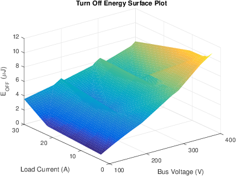
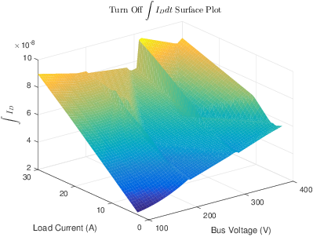

# sweepResults
The sweepResults object stores multiple [DoublePulseResults][DoublePulseResults] that make up a sweep. It also contains methods for plotting the results of a sweep.

## Table of Contents
[TOC]

## Properties
### chan4Results
| Properties | |
|---------|:--|
| Default Value |  |
| Type | [DoublePulseResults][DoublePulseResults] |
| Units |  |
| Description | Vector containing all of the 4 channel waveforms from a given sweep. |
|||

### chan2Results
| Properties | |
|---------|:--|
| Default Value |  |
| Type | [DoublePulseResults][DoublePulseResults] |
| Units |  |
| Description | Vector containing all of the 2 channel waveforms from a given sweep. |
|||

### chan4ByVoltage
| Properties | |
|---------|:--|
| Default Value |  |
| Type | containers.Map |
| Units |  |
| Description | Map containing all of the 4 channel waveforms from a given sweep grouped by approximate bus voltage. For example to obtain an array of all of the 400 V [DoublePulseResults][DoublePulseResults] from a given sweep you would use the following command <code class="prettyprint lang-MATLAB">sweepResultsObj.chan4ByVoltage(400)</code>. If you do not know what voltages are contained in a given sweep you can use the command <code class="prettyprint lang-MATLAB">sweepResultsObj.chan4ByVoltage.keys</code> to receive a cell array of all existing voltages. |
|||

### chan2ByVoltage
| Properties | |
|---------|:--|
| Default Value |  |
| Type | containers.Map |
| Units |  |
| Description | Map containing all of the 2 channel waveforms from a given sweep grouped by approximate bus voltage. For example to obtain an array of all of the 400 V [DoublePulseResults][DoublePulseResults] from a given sweep you would use the following command <code class="prettyprint lang-MATLAB">sweepResultsObj.chan2ByVoltage(400)</code>. If you do not know what voltages are contained in a given sweep you can use the command <code class="prettyprint lang-MATLAB">sweepResultsObj.chan2ByVoltage.keys</code> to receive a cell array of all existing voltages. |
|||

### currentDelay
| Properties | |
|---------|:--|
| Default Value |  |
| Type | Float |
| Units | Seconds |
| Description | Current delay used for the sweep contained in the object. This property tells you what the deskew was set to in the oscilloscope during the waveform capture.|
|||

## Properties (Private)
### plotIntResults
| Properties | |
|---------|:--|
| Default Value |  |
| Type | [DoublePulseResults][DoublePulseResults] |
| Units |  |
| Description | Temporary storage point for plotting methods. |
|||

## Methods (Protected)
### copyElement
| Method | |
|--------|:--|
| Arguments |  |
| Output | ([SweepResults][SweepResults]) cpObj |
| Description | Method enables deep copy of all object properties. Not called directly, but used when using the copy() function to duplicate a sweep object. |
|||

## Methods
### Constructor
| Method | |
|--------|:--|
| Arguments |  |
| Output | [SweepResults][SweepResults] |
| Description | Creates the [chan4ByVoltage](#chan4byvoltage) and [chan2ByVoltage](#chan2byvoltage) maps. |
|||

### addResult
| Method | |
|--------|:--|
| Arguments | (Integer) numChannels, (Integer) busVoltage, ([DoublePulseResults][DoublePulseResults]) result |
| Output |  |
| Description | Adds a new result to the sweep. Must provide the number of channels in the result, the approximate bus voltage, and the result itself. |
|||

### runAllPlots
| Method | |
|--------|:--|
| Arguments | (String \| Boolean) imageType, (String) saveDirectory |
| Output |  |
| Description | This method runs all methods in the class that have the string (case sensitive) <code class="prettyprint lang-MATLAB">'plot'</code> anywhere in their name. The method can save the results of all plotting methods to disk, to set the image type you must set the imageType parameter to your desired file type. Unless you have a compelling reason not to, it is highly recommended that you choose a vector image file format (e.g. <code class="prettyprint lang-MATLAB">{ 'pdf' \| 'eps' \| 'emf' }</code>) for this argument. You may turn off saving the image by setting the imageType parameter to <code class="prettyprint lang-MATLAB">false</code>. The save saveDirectory argument is optional, if one is not provided the files will be saved in <code class="prettyprint lang-MATLAB">./plotImages/[imageType]/</code>. In order to save figures you must download the [export_fig](https://www.mathworks.com/matlabcentral/fileexchange/23629-export-fig) function from the MathWorks file Exchange and add it your MATLAB path. If you are interested in doing weird things with MATLAB I would encourage you to read and understand the source code for this method, it's pretty neat! |
|||

### reCalcResults
| Method | |
|--------|:--|
| Arguments |  |
| Output |  |
| Description | This method will recalculate all of the calculations for all [DoublePulseResults][DoublePulseResults] stored in the sweep. Useful if a calculation method is changed or a new one is added and you want to apply this to old data. |
|||

### shiftAllCurrents
| Method | |
|--------|:--|
| Arguments | (Float) nanoSec |
| Output |  |
| Description | Shifts all currents by nanoSec nanoseconds (i.e. nanoSec = 5 will shift by 5 nanoseconds, nanoSec = 5e-9 will shift by 5 attoseconds.) Pay special attention to the sign of nanoSec when you run this method and ensure that the current has moved in the direction you intended.|
|||

### plotSweep
| Method | |
|--------|:--|
| Arguments | ([SweepPlotSettings][SweepPlotSettings]) plotSettings |
| Output | (Figure) plotFigure |
| Description | Creates a plot with the settings given in the [SweepPlotSettings][SweepPlotSettings] object plotSettings. Returns the figure created if further customization is desired.   |
|||

### plotEOn
| Method | |
|--------|:--|
| Arguments |  |
| Output | (Figure) plotFigure |
| Description | Plots the full sweep turn on energy vs. load current. |
|||

### plotEOff
| Method | |
|--------|:--|
| Arguments |  |
| Output | (Figure) plotFigure |
| Description | Plots the full sweep turn off energy vs. load current. |
|||

### plotSurfacePlot
| Method | |
|--------|:--|
| Arguments | ([SurfacePlotSettings][SurfacePlotSettings]) surfacePlotSettings |
| Output | (Figure) surfFigure, (Surf) surfObj, (axis) ax |
| Description | Creates a surface plot from the given surface plot settings. Returns the figure, surf Object, and axis for additional customization if desired. |
|||

### plotEOnSurface
| Method | |
|--------|:--|
| Arguments |  |
| Output | (Figure) surfFigure, (Surf) surfObj, (axis) ax  |
| Description | Creates a surface plot of the turn on energy loss vs bus voltage and load current. |
|||

### plotEOffSurface
| Method | |
|--------|:--|
| Arguments |  |
| Output | (Figure) surfFigure, (Surf) surfObj, (axis) ax  |
| Description | Creates a surface plot of the turn off energy loss vs bus voltage and load current. |
|||

### plotPeakOnVSurface
| Method | |
|--------|:--|
| Arguments |  |
| Output | (Figure) surfFigure, (Surf) surfObj, (axis) ax  |
| Description |  Creates a surface plot of the peak turn on $V_{DS}$ vs bus voltage and load current. |
|||

### plotPeakOffVSurface
| Method | |
|--------|:--|
| Arguments |  |
| Output | (Figure) surfFigure, (Surf) surfObj, (axis) ax  |
| Description |  Creates a surface plot of the peak turn off $V_{DS}$ vs bus voltage and load current. |
|||

### plotVdsOnIntSurface
| Method | |
|--------|:--|
| Arguments |  |
| Output | (Figure) surfFigure, (Surf) surfObj, (axis) ax  |
| Description |Creates a surface plot of the integral of $V_{DS}$ during turn on vs bus voltage and load current.   |
|||

### plotVdsOffIntSurface
| Method | |
|--------|:--|
| Arguments |  |
| Output | (Figure) surfFigure, (Surf) surfObj, (axis) ax  |
| Description |Creates a surface plot of the integral of $V_{DS}$ during turn off vs bus voltage and load current.   |
|||

### plotIdOnIntSurface
| Method | |
|--------|:--|
| Arguments |  |
| Output | (Figure) surfFigure, (Surf) surfObj, (axis) ax  |
| Description |Creates a surface plot of the integral of $I_D$ during the turn on vs bus voltage and load current.   |
|||

### plotIdOffIntSurface
| Method | |
|--------|:--|
| Arguments |  |
| Output | (Figure) surfFigure, (Surf) surfObj, (axis) ax  |
| Description |Creates a surface plot of the integral of $I_D$ during the turn off vs bus voltage and load current.   |
|||

### plotTVRSurface
| Method | |
|--------|:--|
| Arguments |  |
| Output | (Figure) surfFigure, (Surf) surfObj, (axis) ax  |
| Description |Creates a surface plot of the voltage rise time vs bus voltage and load current.   |
|||

